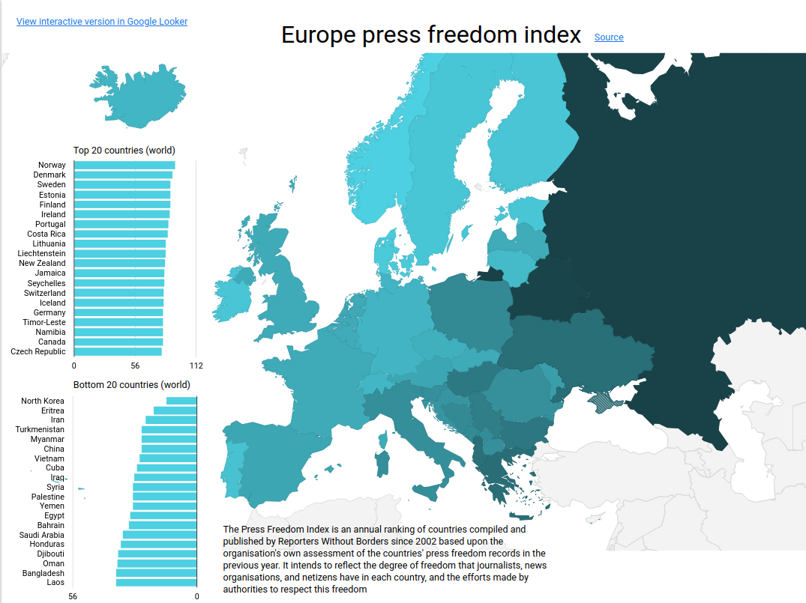
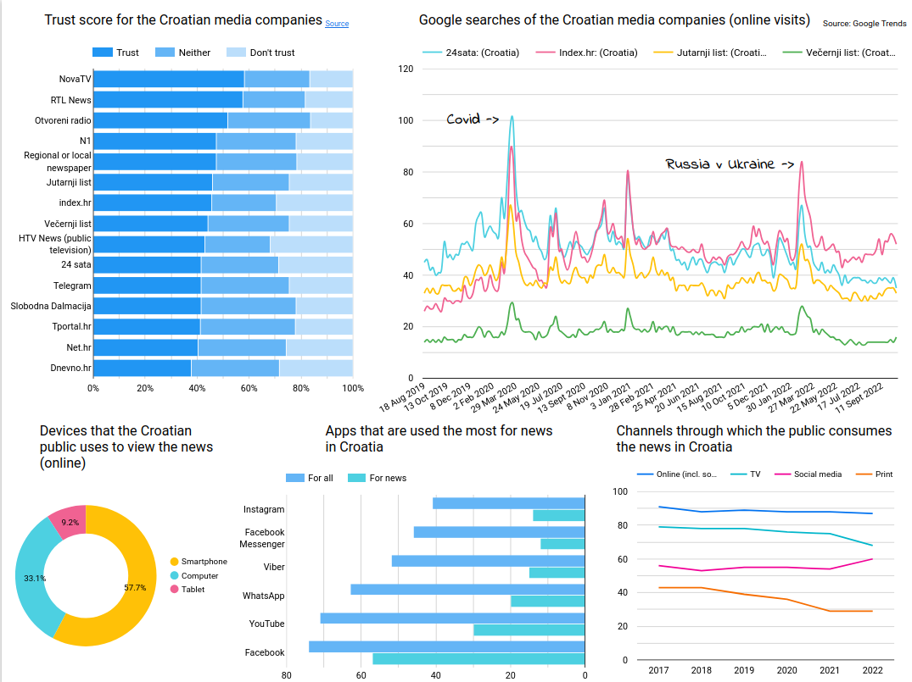
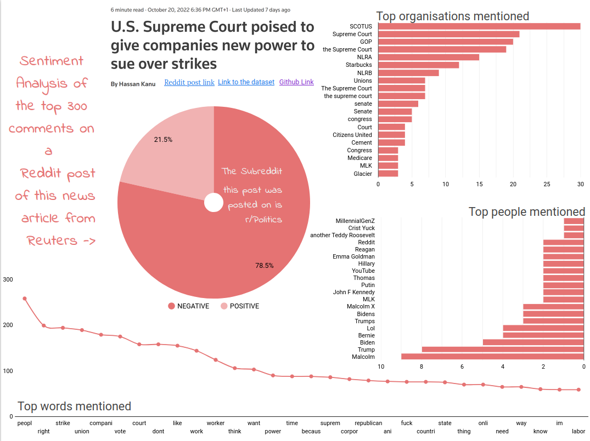

# European Media Sentiment Dashboard

## Europe Press Freedom Index

This visualization presents the degree of media freedom across European countries, based on the Media Freedom Index annually compiled by Reporters Without Borders. The map clearly highlights the stark differences between northern European countries, which enjoy very high levels of media freedom (e.g., Norway, Denmark, Sweden), and southeastern and eastern European countries, where media freedom is considerably lower. This contrast is particularly noticeable in countries like Russia and Belarus, shaded in darker tones, indicating lower freedom levels. The map effectively illustrates regional disparities in Europe and underscores the significance of political and social factors influencing journalistic freedom.

## 2. Croatian Media Analysis

The second slide provides a detailed overview of trust levels in Croatian media outlets, devices, apps, and channels used for accessing news, and public interest in media outlets as indicated by Google searches. Television networks such as NovaTV and RTL hold the highest public trust, whereas news portals like Dnevno.hr and Net.hr are trusted the least. A significant majority (57.7%) of Croatian citizens access news primarily via smartphones, with Facebook and YouTube being the dominant platforms. A notable increase is observed in the use of social media and online channels for news consumption compared to traditional print media, which shows a marked decline. Major events like the COVID-19 pandemic and the war in Ukraine are clearly reflected in spikes of interest in Google search trends.

## 3. Reddit Comments Sentiment Analysis

The final slide showcases sentiment analysis of Reddit comments regarding the news of the U.S. Supreme Court decision granting companies greater authority in lawsuits against strikes. Negative sentiment overwhelmingly dominates, with 78.5% of comments categorized as negative. Frequently mentioned organizations include the U.S. Supreme Court (SCOTUS) and the GOP political party, while Malcolm, Trump, and Biden are among the most mentioned individuals. Keywords strongly emphasize labor rights, unions, and strikes, indicating significant concern among Reddit users about the implications of this judicial decision on workers' rights.

